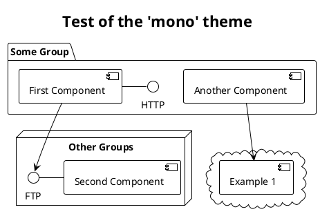

```plantuml
@startuml
title Test of the 'mono' theme

!theme mono

package "Some Group" {
  HTTP - [First Component]
  [Another Component]
}

node "Other Groups" {
  FTP - [Second Component]
  [First Component] --> FTP
}

cloud {
  [Example 1]
}

[Another Component] --> [Example 1]
@enduml
```