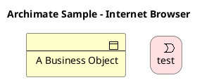
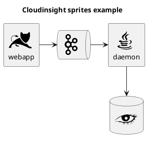
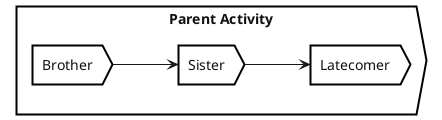

# icon


```plantuml
listopeniconic
```


# stdlib

```plantuml
stdlib
```

## Archimate
```plantuml
listsprite
```



## AWS

```plantuml
!include <awslib/AWSCommon>
!include <awslib/InternetOfThings/IoTRule>
!include <awslib/Analytics/KinesisDataStreams>
!include <awslib/ApplicationIntegration/SimpleQueueService>

left to right direction

agent "Published Event" as event #fff

IoTRule(iotRule, "Action Error Rule", "error if Kinesis fails")
KinesisDataStreams(eventStream, "IoT Events", "2 shards")
SimpleQueueService(errorQueue, "Rule Error Queue", "failed Rule actions")

event --> iotRule : JSON message
iotRule --> eventStream : messages
iotRule --> errorQueue : Failed action message

```


## CloudInsight




## edgy





```plantuml
!include <edgy/edgy>

$experienceFacet(Experience, experience)
$architectureFacet(Architecture, architecture)
$identityFacet(Identity, identity)

$organisationFacet(Organisation, org) {
	$organisation(Organisation, organisation)
}

$brandFacet(Brand) {
	$brand(Brand, brand)
}

$productFacet(Product){
	$product(Product, product)
}

$flow(brand, identity, "represents/evokes")
$flow(brand, experience, "Supports/appears in")

$flowLeft(organisation, identity, "pursues/authors")
$flowRight(organisation, architecture, "has/performs")

$flow(product, experience, "serves/features in")
$linkUp(product, architecture, "requires/creates")

$flow(organisation, brand, "builds")
$flow(organisation, product, "makes")
$flowLeft(product, brand, "embodies")
```